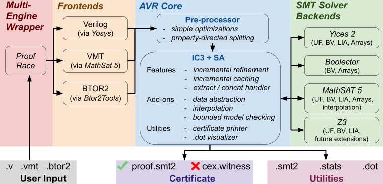

# AVR -- **A**bstractly **V**erifying **R**eachability

<p align="center">(also known as Averroes v2.0)
</p>


> Copyright (c) 2016 - Present  Aman Goel [(amangoel@umich.edu)](amangoel@umich.edu)  and  Karem Sakallah [(karem@umich.edu)](karem@umich.edu) , University of Michigan

Reads a state transition system and performs property checking  using equality abstraction

#### News
- AVR source code is now released! Check the folder ```` src/ ````
- [[HWMCC'20](http://fmv.jku.at/hwmcc20/)] AVR won *1<sup>st</sup>* place at the prestigious *Hardware Model Checking Competition* (HWMCC) 2020
<p align="center">
	</img>
</p>

#### Research Papers
- [[TACAS'20](https://link.springer.com/chapter/10.1007%2F978-3-030-45190-5_23)] AVR at a high level
- [[NFM'19](https://link.springer.com/chapter/10.1007/978-3-030-20652-9_11)]   Syntax-guided abstraction technique implemented in AVR
- [[DATE'19](https://ieeexplore.ieee.org/document/8715289)]  Empirically understand the benefits of AVR
- [[SOSP'19](https://dl.acm.org/doi/10.1145/3341301.3359651)]  Using AVR for verifying distributed protocols

#### Build from source
- Download/clone the GitHub repository
- Simply run ```` ./build.sh ```` from the avr folder to install all dependencies and compile the source code with default options. AVR binaries are generated in the folder ```` build/bin/ ````

#### How to run AVR
	python3 avr.py -o <output-path> -n <test-name> <path>/<file>.btor2
	(check the output in <output-path>/work_<test-name>)
	 
	Example:	python3 avr.py -o foo -n bar examples/btor2/counter.btor2
				(check the output in foo/work_bar)

#### Tutorial
- Follow the tutorial artifact on using AVR [[artifact](https://zenodo.org/record/3677545#.Xw5iAHVKhhE)] 

#### AVR Proof Race
Use AVR *Proof Race* to automatically run multiple configurations in parallel
- Allows process-level parallelism to solve the problem within a given time and memory budget

#### How to run Proof Race
	python3 avr_pr.py -o <output-path> -n <test-name> <path>/<file>.btor2
	(check the output in <output-path>/pr_<test-name>)
	 
	Example:	python3 avr_pr.py -o foo -n bar examples/btor2/counter.btor2
				(check the output in foo/pr_bar)

#### AVR Tool Flow



#### Output
AVR creates a directory ```<output-path>```/pr_```<test-name>``` which contains results, statistics and logs relating to the run

````
<output-path>
└── pr_<test-name>
    ├── <test-name>.btor2		[BTOR2 input file]
    ├── result.pr			[result: h for safe, v for unsafe, f_* for timeout / memout / error]
    ├── cex.witness			[witness in BTOR2 format (if property is proved unsafe)]
    ├── inv.txt				[inductive invariant proof (if property is proved safe)]
    ├── <test-name>.results		[statistics file]
    ├── design.smt2			[input design in VMT format]
    ├── inv.smt2			[inductive invariant proof in VMT format (if property is proved safe)]
    └── work_w<i>/			[worker <i> log directory]
````
As a quick summary relating to the run, AVR produces certain key information as output.
	For example, running ```python3 avr_pr.py examples/btor2/counter.btor2``` produces the following output:
````
@     0s  (starting avr proof race)
@     0s  (output dir: output/pr_test)
@     0s  (max 5 workers)
@     0s  (started worker 0 with pid 13366)
@     0s  (started worker 1 with pid 13368)
@     0s  (started worker 2 with pid 13370)
@     0s  (spawned 3 workers)
@     0s  (total 3 workers using 37 MB)
@     0s  (worker 0 finished with result safe) python3 avr.py
@     0s  (worker 0 output)
	(output dir: output/pr_test/work_w0)
	(frontend: btor2)
	(property: all (1 assertions))
	(4 / 4 flops initialized)
	(abstraction: sa+uf)
   1	: 0	: 0 s: 0    0s                  
   2	: 1	: 0 0 s: 0    0s                  
   2	: 1	: 0 0 s: 0    0s                  
      Result        Time        Mem.       #Refs           
                     sec          MB                       
           h        0.01          15           2
@     0s  (stopping all workers)
@     0s  (proof race finished with answer safe in 0.19 seconds)
@     0s  (copied results from worker 0 in output/pr_test)
````
":" separated numbers indicate the following:

```<# of refinements learnt> : <max frame> : <# of added clauses in each frame> s: <total # of clauses learnt>```

Result can be mapped as follows:
````
h	-> Property holds (safe)			[inv.txt contains the inductive invariant proof]
v	-> Property violated (unsafe)			[cex.witness contains the counterexample]
f_*	-> Time or memory limit exceeded / error 
````

#### Dependencies
- [Yosys](https://github.com/YosysHQ/yosys) &nbsp;&nbsp;&nbsp;&nbsp;&nbsp;&nbsp;&nbsp;&nbsp; [copyright (c) Clifford Wolf] 
--------------------------------------------- Verilog / VHDL frontend
- [Yices 2](https://github.com/SRI-CSL/yices2)  &nbsp;&nbsp;&nbsp;&nbsp;&nbsp;&nbsp; [copyright (c) SRI International] 
--------------------------------------- SMT solver backend
- [Z3](https://github.com/Z3Prover/z3)  &nbsp;&nbsp;&nbsp;&nbsp;&nbsp;&nbsp;&nbsp;&nbsp;&nbsp;&nbsp;&nbsp;&nbsp;&nbsp; [copyright (c) Microsoft Corporation] 
--------------------------------- SMT solver backend
- [MathSAT5](http://mathsat.fbk.eu/)  &nbsp; [copyright (c) 2020 Fondazione Bruno Kessler, Italy] 
------------------- VMT frontend, SMT solver backend
- [Boolector](https://github.com/Boolector/boolector)  &nbsp;&nbsp; [copyright (c) Armin Biere, Robert Brummayer, Aina Niemetz, Mathias Preiner] 
--------------------------------------------------------------------------- BTOR2 frontend, SMT solver backend, BTORMC
- [JG](https://www.cadence.com/content/cadence-www/global/en_US/home/tools/system-design-and-verification/formal-and-static-verification/jasper-gold-verification-platform.html)  &nbsp;&nbsp;&nbsp;&nbsp;&nbsp;&nbsp;&nbsp;&nbsp;&nbsp;&nbsp;&nbsp;&nbsp;&nbsp;&nbsp; [copyright (c) Cadence Design Systems, Inc.] 
-------- JG frontend

#### License
Copyright (c) 2016 - Present  Aman Goel and Karem Sakallah, University of Michigan. All rights reserved.

AVR is provided as is, without any warranty.
Any usage of AVR needs to comply with the usage terms as detailed in the file [LICENSE](https://github.com/aman-goel/avr/blob/master/LICENSE).

#### Notes for Pro Users
- By default, Yices 2 backend is used for all SMT queries.
- Enable appropriate ```BACKEND_*``` flag in ```src/reach/reach_backend.h``` to change solver backends for different kinds of SMT queries.
- Pro tip: compile AVR binaries with different ```BACKEND_*``` flags in ```src/reach/reach_backend.h``` (rename ```build/bin/``` folder every time), and customize proof race workers in ```workers.txt``` (by changing ```--bin <binary-path>```) to run proof race with different SMT solver configurations.
- After each run, AVR produces a statistics file called ```<test-name>.results```. Here is an incomplete and somewhat outdated description on these statistics: [link to spreadsheet](https://docs.google.com/spreadsheets/d/1uQQu1ISqhzZIgv1dTtlXIEyHErClrnJRr1jXxqcmrmc/edit?usp=sharing).
- If Verilog frontend is needed, make appropriate changes in ```` ./build.sh ```` to install [Yosys](https://github.com/YosysHQ/yosys)
- ```<output-path>``` (default: output) and ```<test-name>``` (default: test) can be customized using command-line options ```-o``` and ```-n``` in ```avr_pr.py```).
- AVR is still in development phase and uses several parameters internally for efficient property checking. Many such parameters can be tuned / corrected, including frontend support via Yosys.
- After proving a property, AVR performs a series of checks to ensure correctness of the result (for the interpreted system).
- AVR performs best especially for control-centric properties and is almost independent of the bit-width of words in the system.
- Memory abstraction technique is still in development phase.
- Use --vmt to read in a .vmt file.
	[supported theories: quantifier-free bit-vectors, linear integer arithmetic and arrays]
- [Verilog / VHDL] Property description is expected to be present in the top module, and not in submodules.
- ```property``` is a reserved keyword.
- Initial state conditions collected by AVR are listed in parse.results file.
- Multiple properties are allowed. One can select a single property by using option --property ```<prop-name>``` in the ```avr.py```. The option tries finding a signal named ```*<prop-name>``` in the design as property and discards all other assertions (if a match is found).
- There is also limited support for SystemVerilog concurrent assumptions using assume property ( .. ).
- Use option --effort_mininv to minimize inductive invariant (in the case property is true).
        0 (no minimization), 1 (abstract fast), 2 (abstract slow), 3 (concrete fast), 4 (concrete slow)
- Use --abstract to enable/disable data abstraction.
 	   sa (no data abstraction, QF_BV), sa+uf (data abstraction, QF_UF), 
 	   saN+ecM (no data abstraction upto bit-width of N, 
 	            extract/concat interpretation level is M [0: none, 1: some (default), 2: full])
- Use --granularity to configure abstract granularity level
       0 (lowest), 1 (also allow sv-inp mixed constraints), 2 (also allow inp constraints).
- Use --level to configure abstraction fineness level
       0 (lowest), 1 (also allow local equality), 2 (also allow variable equality), 3 (also allow variable equality with extract/concat),
      4 (also allow other predicates), 5 (also allow function equality).
- Use --lazy_assume to configure laziness of assumptions
       0 (eager- add all assumptions), 1 (lazy- add assumptions but don't introduce new cones), 2 (lazy- don't add assumptions).
- Use --smt2 to print the design in SMT-LIB v2 format
- Use --dot <7-digit binary> to visualize the design and AVR learning using .dot files. Example- --dot 1000011
      position: 0 (property), 1 (transition relation), 2 (assumptions), 3 (xcat handler), 4 (xcat handler detailed), 
                5 (refinement axioms), 6 (IC3 query solutions).
- Use --witness to print witness in BTOR2 (for disproved) / SMT-LIB v2 (for proved) format
- Use --bmc to instead run a BMC engine (set max bmc bound using --kmax)

We would be glad to hear from you and help you in the case you are having a difficulty in using AVR
Please report bugs and share your usage experience via email  [(amangoel@umich.edu)](amangoel@umich.edu) or on github [(https://github.com/aman-goel/avr)](https://github.com/aman-goel/avr)
