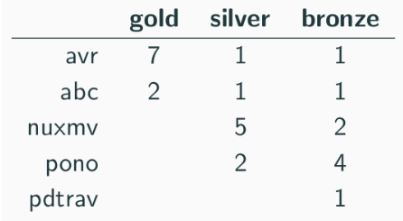

# AVR at [HWMCC 2020](http://fmv.jku.at/hwmcc20/)

AVR won *1<sup>st</sup>* place at the prestigious *Hardware Model Checking Competition* (HWMCC) 2020
<p align="center">
	</img>
</p>


#### Details:
```xtras/workers_hwmcc2020_updated.txt``` lists AVR configurations that were run in AVR proof race in the HWMCC 2020 competition.


- ```--bin bin_y2```: AVR with Yices 2 for all SMT queries
- ```--bin bin_bt_cad```: AVR with Boolector (with CaDiCaL) for all SMT queries
- ```--bin bin_hybrid```: AVR with Yices 2 for all abstract SMT queries, Boolector for bitvector queries
